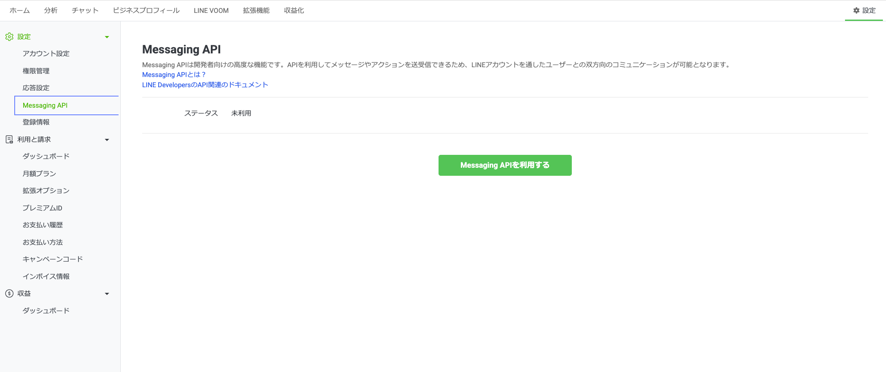
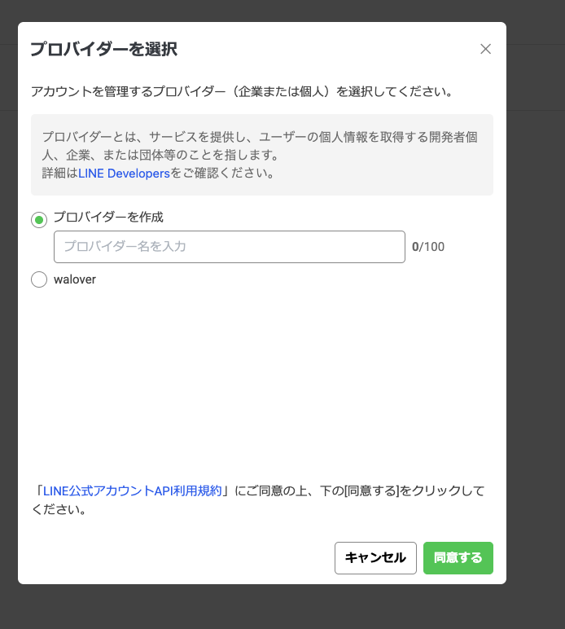
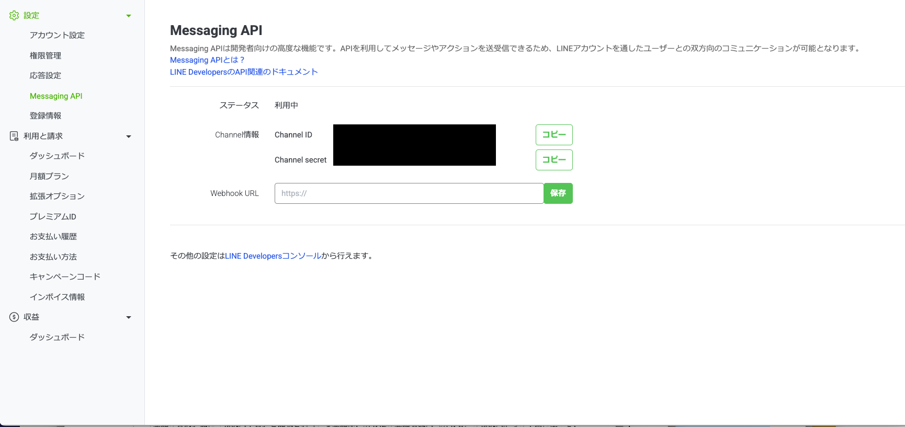
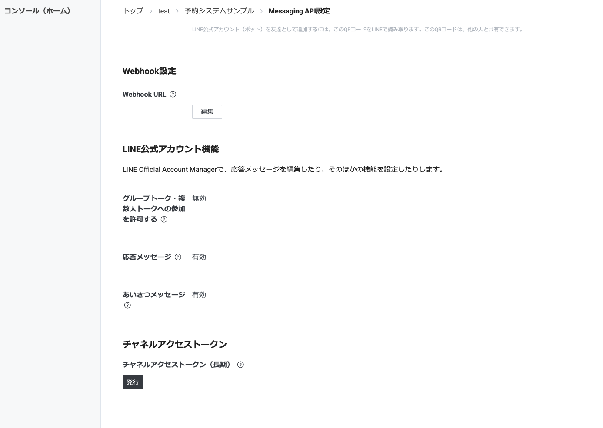
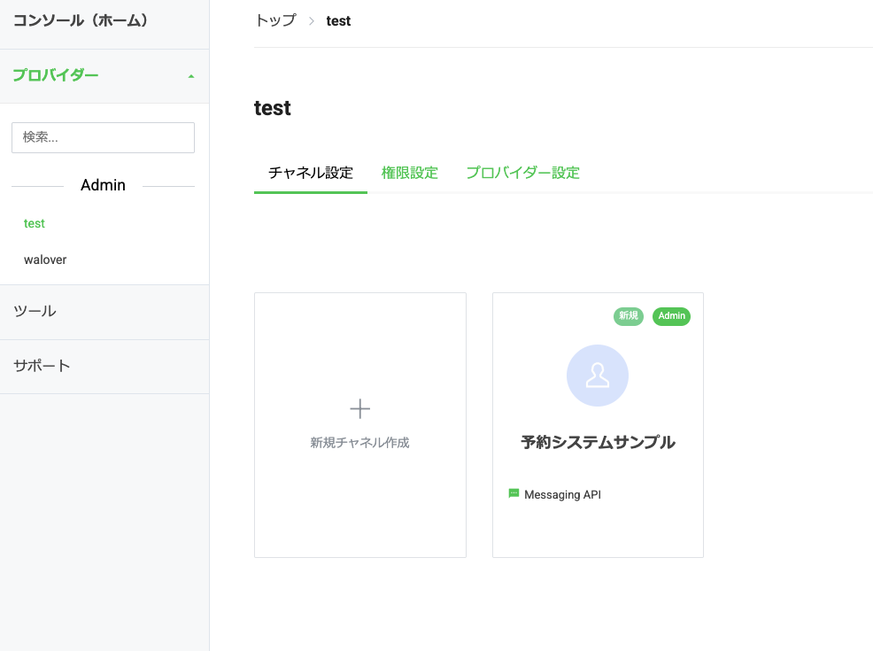
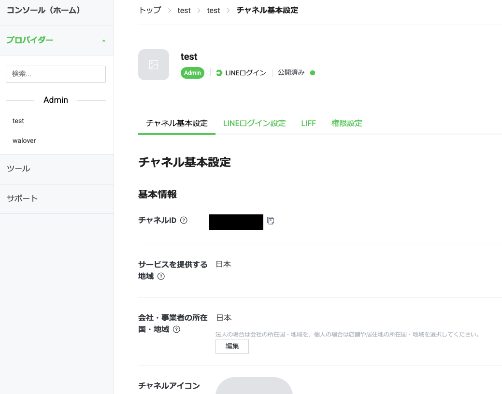
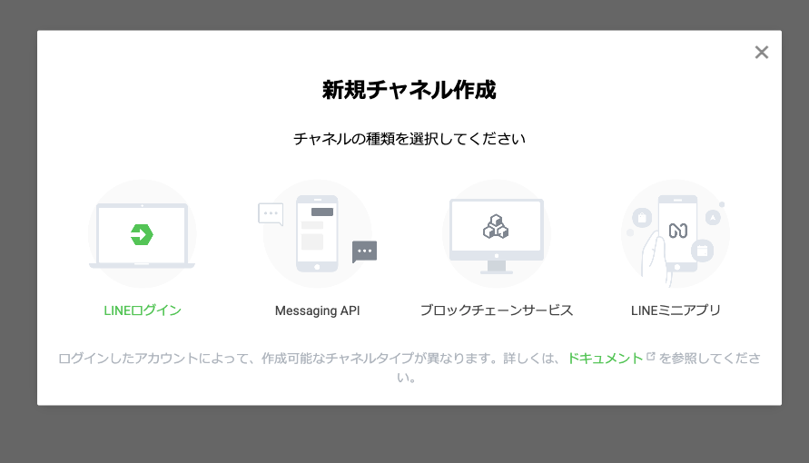
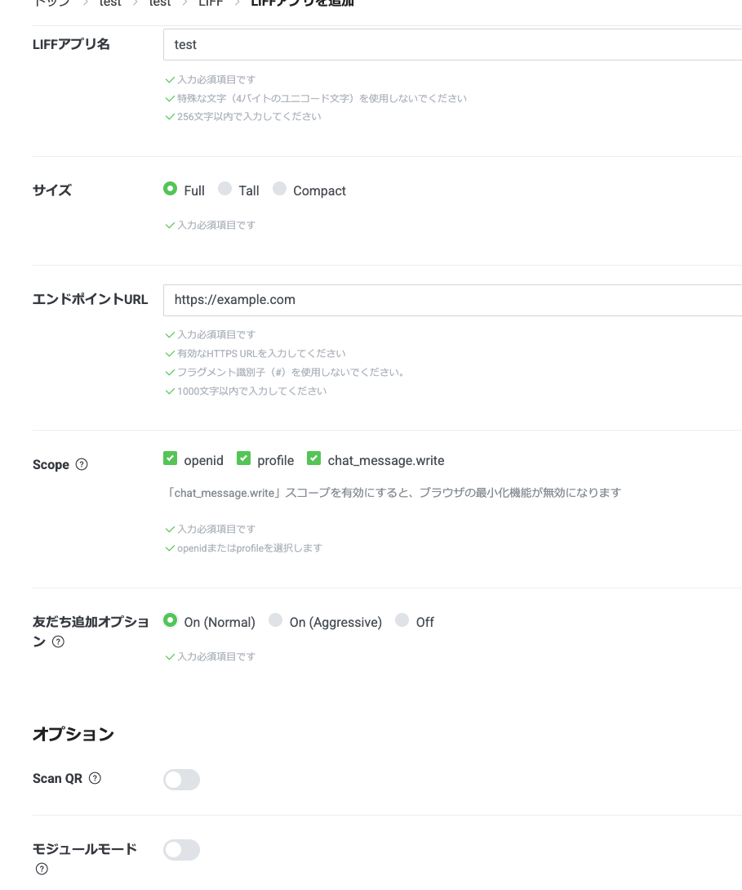
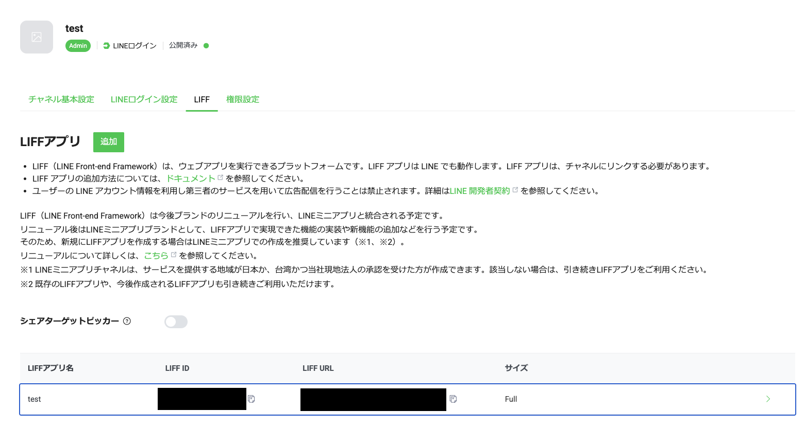

# LINE 側の準備

[← 配布キットのトップに戻る](../../README.md) ／ [← 1. Cloudflare の準備](cloudflare.md)

セットアップツールは、実行中に **LINE の設定値を5つ**聞いてきます。
ここで**先に全部そろえてしまいます。** 途中で取りに戻らなくて済むようにするためです。

**所要時間**：約30〜40分
**必要なもの**：LINE アカウント（普段お使いのもので大丈夫です）

> 💡 **このページの使い方**
> リンクは**別のタブで開きます**。作業が終わったらそのタブを閉じて、このページに戻ってきてください。
> リンクを押したときにログイン画面が出たら、そのままログインしてください。

---

<a id="secret"></a>

## ⚠️ 先に読んでください：これから扱う情報について

このあと **チャネルシークレット** と **チャネルアクセストークン** を取得します。
これは **LINE 公式アカウントのパスワードに相当するもの**です。他人に渡ると、
あなたのアカウントから勝手にメッセージを送られます。

守っていただきたいのは、この3つです。

1. **スクリーンショットに写さない** — 質問のために画像を送るときは、この部分を隠してください
2. **チャットやメールに貼らない** — Claude への指示文にも直接書かないでください
3. **紙かパスワード管理アプリに控える** — 一時的にメモ帳に置く場合は、作業が終わったら消してください

> 🔐 もし誤って人に見られてしまった場合は、**LINE Developers の画面から再発行すれば、
> 古いものは無効になります。** 取り返しのつかない事故ではないので、落ち着いて対処してください。
> 心配なときは連絡をください。

---

## 集めるもの（チェックリスト）

作業が終わるたびに、埋まったか確認してください。

| # | 名前 | どんな形か | 取得する場所 |
|---|---|---|---|
| ① | **Channel ID** | 数字だけ | [Step 1](#step1) |
| ② | **チャネルシークレット** | 英数字の長い文字列 🔐 | [Step 2](#step2) |
| ③ | **チャネルアクセストークン（長期）** | とても長い英数字 🔐 | [Step 3](#step3) |
| ④ | **チャネル ID（LINE ログイン用）** | 数字だけ・**①とは別物** | [Step 4](#step4) |
| ⑤ | **LIFF ID** | `数字-英数字`（ハイフンあり） | [Step 5](#step5) |

あわせて、**プロバイダー名**（Step 1 で決める、会社名や屋号）も控えておいてください。
Step 3・4・5 で、このプロバイダーを選ぶ場面が出てきます。

> 🔴 **①と④はどちらも「チャネル ID」という名前ですが、別物です。**
> ①は「メッセージを送受信する側」、④は「ログインする側」の ID です。
> 取り違えるとセットアップが通らないので、**メモに「①」「④」と番号を書いて**おいてください。

---

<a id="step0"></a>

## Step 0：LINE 公式アカウントを用意する

すでにお持ちの方は [Step 1](#step1) へ進んでください。

👉 **[LINE Official Account Manager を開く](https://manager.line.biz/)**

LINE アカウントでログインし、アカウントを作成します。**個人でも作れますし、無料プランで十分です。**

> 💡 **練習用に新しく作るのがおすすめです。**
> すでに使っている公式アカウントで試すと、お客様に予期しないメッセージが届く可能性があります。

✅ **終わったら**：このページに戻ってきてください。

---

<a id="step1"></a>

## Step 1：① Channel ID を取得する

👉 **[LINE Official Account Manager を開く](https://manager.line.biz/)**

まず、設定画面の Messaging API を開きます。

```
アカウントを選択
→ 右上の歯車アイコン（設定）
→ サイドメニューの「Messaging API」
```

### 1-a. ステータスを確認する

開いた画面の **ステータス** を見てください。



| ステータス | どうするか |
|---|---|
| **未利用** | 上の画像のように緑の **「Messaging APIを利用する」** ボタンが出ています。**押してください** → [1-b](#step1b) へ |
| **利用中** | すでに有効です。Channel ID が画面に表示されているので、[1-c](#step1c) へ |

> 🔴 **ここが抜けやすいところです。**
> 「未利用」のまま先に進もうとしても、Channel ID はどこにも表示されません。
> **まずこのボタンを押す**のが最初の一歩です。

<a id="step1b"></a>

### 1-b. プロバイダーを選んで、利用規約に同意する

ボタンを押すと、この画面が出ます。



**プロバイダー**とは、このアカウントを管理する「提供者」のことです。会社や個人の単位だと思ってください。

- **初めての方** → **「プロバイダーを作成」** を選び、名前を入力します。**会社名や屋号で構いません**
- **すでにプロバイダーをお持ちの方** → 一覧に名前が出ているので、それを選びます
  （上の画像で `walover` と出ているのが、既存のプロバイダーの例です）

名前を決めたら、**「LINE公式アカウントAPI利用規約」に同意**して、右下の **「同意する」** を押します。

> ⚠️ **プロバイダー名はあとから変えにくいので、慎重に決めてください。**
> このあとの Step 3・4・5 でも、ここで作ったプロバイダーを選ぶことになります。**名前を覚えておいてください。**

<a id="step1c"></a>

### 1-c. Channel ID を控える

同意すると、ステータスが **利用中** に変わり、画面に **Channel ID** が表示されます。

✅ **終わったら**：**① Channel ID（数字）** を控えてください。

> ⚠️ **この画面を閉じないでください。** 次の Step 2 で使う値が、同じページに表示されています。

---

<a id="step2"></a>

## Step 2：② チャネルシークレットを取得する 🔐

**Step 1 と同じページに表示されています。** 新しく開く必要はありません。

ステータスが **利用中** に変わると、`Channel ID` と `Channel secret` が並んで表示されます。



右の **「コピー」ボタン**を使ってください。手で書き写すと入力ミスの原因になります。

- 上の **Channel ID** → **①**
- 下の **Channel secret** → **②**

✅ **終わったら**：**① Channel ID** と **② チャネルシークレット** の両方を控えて、このページに戻ってきてください。

> 🔐 上の画像で黒く塗りつぶしてある部分が、まさに**人に見せてはいけない値**です。
> 質問でスクリーンショットを送るときは、**この2つを同じように隠して**ください。

> 💡 この画面には **Webhook URL** の入力欄もありますが、**いまは空のままで構いません。**
> ここに入れる URL は、セットアップツールを動かしたあとで決まります。

---

<a id="step3"></a>

## Step 3：③ チャネルアクセストークンを発行する 🔐

ここからは **LINE Developers Console**（開発者向けの画面）に移ります。

👉 **[LINE Developers Console を開く](https://developers.line.biz/console/)**

```
Step 1 で作ったプロバイダーを選択
→ Messaging API チャネルを選択
→ 「Messaging API設定」タブ
→ 一番下までスクロール
```

ページの一番下に **「チャネルアクセストークン」** の欄があります。



**「発行」ボタン**を押すと、とても長い文字列が表示されます。

✅ **終わったら**：**③ チャネルアクセストークン** をコピーして控え、このページに戻ってきてください。

> 🔐 パスワード相当です。**必ずコピーしてください**（手入力は現実的ではない長さです）。

> 💡 この画面に見える **「応答メッセージ：有効」「あいさつメッセージ：有効」** は、
> **いまは変えなくて大丈夫です。** セットアップが全部終わったあとに変更します。

---

<a id="step4"></a>

## Step 4：④ LINE ログインチャネルを作る

**①とは別の、新しいチャネルを作ります。** ここが一番混乱しやすいところです。

👉 **[LINE Developers Console を開く](https://developers.line.biz/console/)**

左のメニューから、Step 1 で作った**プロバイダー**を選びます。


> 左側にプロバイダーの一覧が出ます。**Step 1 で決めた名前**のものを選んでください。
> （上の画像では `test` を選んでいます）

**「＋ 新規チャネル作成」** のカードをクリックすると、種類を選ぶ画面が出ます。



> 🔴 **一番左の「LINEログイン」を選んでください。**
> 「Messaging API」ではありません。それは Step 1 でもう作ってあります。

必要事項を入力して作成すると、**「チャネル基本設定」** タブに **チャネル ID** が表示されます。



> 💡 **右の「コピー」ボタンを使ってください。** 手で打ち写すと間違いのもとです。
> 上の画像では、チャネル ID を黒く塗りつぶしています。

✅ **終わったら**：**④ チャネル ID（数字）** を控えてください。

> 🔴 **①と混ざっていませんか？** メモに「④＝ログイン用」と書き添えておいてください。
> このあとの Step 5 も、**このログインチャネルの中**で作業します。画面を閉じないでください。

---

<a id="step5"></a>

## Step 5：⑤ LIFF アプリを作る

LIFF は、LINE の中で開く画面のことです。友だち追加のときに使われます。

**Step 4 で作った LINE ログインチャネル**の中にある、**「LIFF」タブ**を開きます。



まだ何も無いので、**「追加」ボタン**を押します。

> ⚠️ **この画面に「今後は LINEミニアプリでの作成を推奨しています」という案内が出ていますが、
> 今回は無視して「追加」（LIFF アプリ）で進めてください。**
> セットアップツールが必要としているのは LIFF アプリです。ミニアプリでは動きません。

### 入力する内容



**上の画像のとおりに設定してください。ただし1か所だけ変更が必要です。**

| 項目 | 設定する値 |
|---|---|
| LIFF アプリ名 | 任意（例：`友だち追加`） |
| サイズ | **Full** |
| エンドポイント URL | **`https://example.com`** ← 仮の値です。あとで正しい URL に変えます |
| Scope | **`openid`** ／ **`profile`** ／ **`chat_message.write`** の3つすべてにチェック |
| 友だち追加オプション | 🔴 **On (Aggressive)** ← **ここだけ既定値から変更が必要です** |

> 🔴 **「友だち追加オプション」に注意してください。**
> 画面を開いた直後は **`On (Normal)`** が選ばれています（上の画像もその状態です）。
> **`On (Aggressive)` に変更してください。** ここを変えないと、友だち追加が正しく動きません。

> 💡 **オプション（Scan QR / モジュールモード）は、どちらもオフのままで構いません。**

作成すると、LIFF タブの一覧に **LIFF ID** が表示されます。`2009554425-4IMBmLQ9` のように、
**数字とハイフンと英数字**の形をしています。



> 💡 **「LIFF ID」列のコピーボタンを使ってください。** 隣の「LIFF URL」ではありません。
> 上の画像では、LIFF ID と LIFF URL を黒く塗りつぶしています。

> 🔴 **最後に必ず：LIFF アプリを「公開済み」にしてください。**
> 「開発中」のままだと動きません。ここは見落としやすい場所です。

> 💡 **エンドポイント URL が仮の値でいい理由**
> 正しい URL は、セットアップツールが動いたあとで初めて決まります（あなた専用の URL が発行されます）。
> なので今は仮の値を入れておき、**あとで書き換えます**。忘れないよう、後の手順でご案内します。

✅ **終わったら**：**⑤ LIFF ID** を控えてください。

---

## 最終確認

5つすべて埋まりましたか？

| # | 名前 | 形の確認 |
|---|---|---|
| ① | Channel ID | **数字だけ**になっていますか |
| ② | チャネルシークレット | 空欄になっていませんか |
| ③ | チャネルアクセストークン | **とても長い**文字列ですか（短ければ発行し直し） |
| ④ | チャネル ID（ログイン用） | **数字だけ**で、**①と違う値**ですか |
| ⑤ | LIFF ID | **ハイフンが入って**いますか／LIFF アプリは**公開済み**ですか／**友だち追加オプションは On (Aggressive)** ですか |

> ④が①と同じ値になっている場合は、Step 4 でログインチャネルを作れていません。
> [Step 4](#step4) をやり直してください。

✅ **ここまでで LINE 側の準備は完了です。**

---

## 次のステップ

いよいよセットアップツールを動かします。

👉 **[3. セットアップツールの実行へ進む](run.md)**

> ⚠️ **この工程だけ、ターミナルを自分で開く必要があります。**
> ツールはキーボードからの直接入力を前提としているため、Claude に実行させることができません。
> やることは「コマンドを1行貼り付けて質問に答える」だけです。

---

## 困ったときは

**遠慮なく LINE で聞いてください。**

- どの Step で止まったか
- 画面に出ているメッセージ

> 🔐 **スクリーンショットを送るときは、②と③が写っていないか必ず確認してください。**
